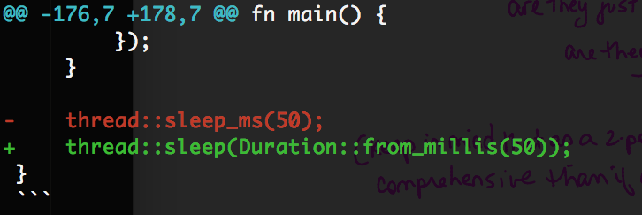
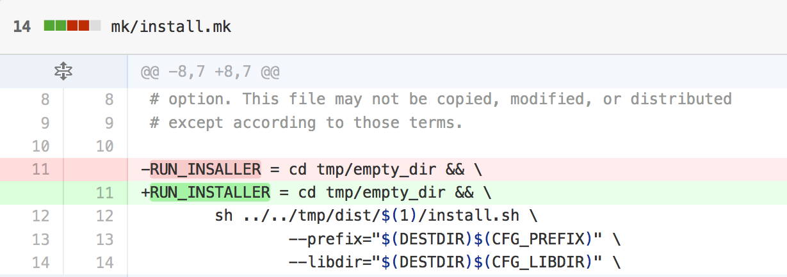

% Patch Review Usability

Alexis Beingessner

Bheesham Persaud

# Programming is Hard

Usability doesn't matter if the system is insecure.

Any error can become a security vulnerability.

# Two Major Strategies for Verification

* Have a computer look at it
* Have a human look at it

# Computers

* Before merging: continuous integration (Travis)
* After merging: program analysis (Coverity, AFL)

# Computers

* Good for catching common errors
* Good for preventing expected regressions
* Lacks semantic understanding of the domain

# Humans

* Before merging: patch review
* After merging: system audits

# Humans

* Can understand semantic issues
* Error-prone

# Patch Review

* First defense against errors
* Frequently performed
* Good interfaces important

# Diffs

Patches are usually presented as a *diff*

but diffs can be difficult to understand

# Better Diffs

One can emphasize parts that "really" changed:

Easier to understand => better review

# Heuristic Walkthrough of Patch Review

We performed a heuristic walkthrough of three different systems
for reviewing patches: Github, Bitbucket, and Reviewable.

# The Patches

Several real patches submitted to the Rust standard library's code base
were selected, ranging from trivial to complex:

* A change that adds tests
* A small update
* A significant refactor

# Task-Based Evaluation

First, several scenarios were considered:

* View the proposed change
* View updates to the proposed change
* View the current reviews of the change
* View the outstanding issues with the change
* View results from continuous-integration

# Task-Based Evaluation

For each type of patch and scenario,
one expert reviewed, and one submitted.

# Evaluation Criteria

???

